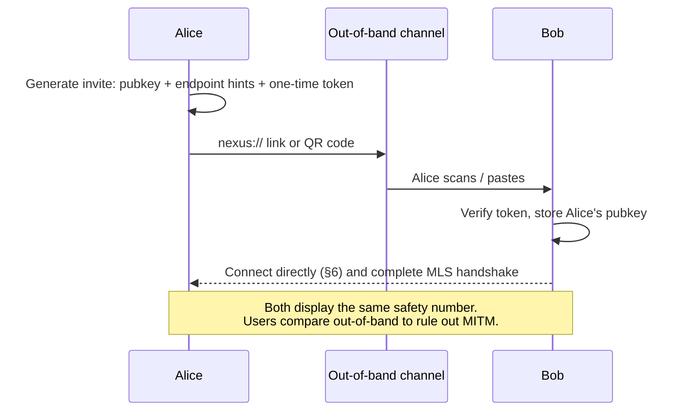
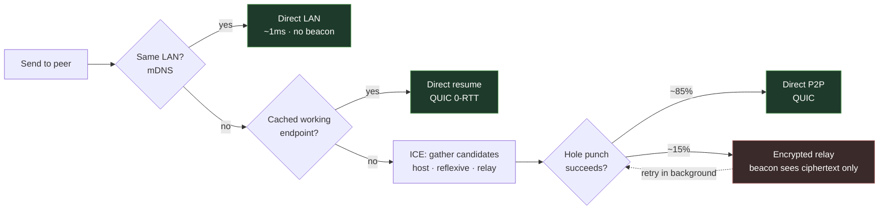
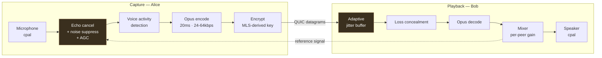
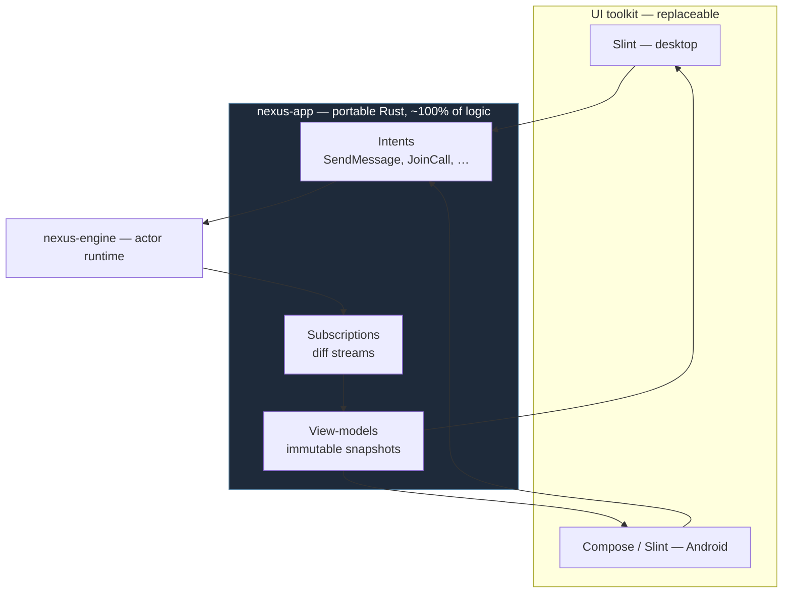

# Nexus Suite — Technical Architecture

**Version:** 1.0
**Date:** 2026-09-01
**Status:** Draft for approval
**Companion documents:** `BRD.md` (what and why) · `DECISIONS.md` (ADRs) · `THREAT-MODEL.md` · `AUDIT.md` · `ROADMAP.md`

---

## 1. Architectural principles

Five rules. When a design question arises, these settle it.

1. **No trusted third party.** Every piece of infrastructure is assumed hostile. If a component
   must be trusted for the system to be private, it is designed wrong.
2. **Cryptography is delegated, not invented.** MLS via `openmls`, AEAD via `ring`, TLS via
   `rustls`. The one thing this project never writes is a novel cryptographic protocol.
3. **The device is the source of truth.** All state lives on user devices. Network components
   move opaque bytes and hold no authoritative state.
4. **Latency is a feature.** Every architectural choice is evaluated against the performance
   budget in `BRD.md` §6.1. "We'll optimise later" is not accepted for anything on the input,
   render, or send path.
5. **The UI is a thin projection.** All logic lives in Rust, below the toolkit boundary. The
   UI layer renders a view-model and emits intents. This keeps the toolkit replaceable
   (`R2` in `BRD.md` §8) and keeps every platform sharing one implementation.

---

## 2. System overview

```mermaid
graph TB
    subgraph DevA ["Device A — Alice"]
        UIA["nexus-ui<br/>Slint · GPU rendered"]
        VMA["nexus-app<br/>view-models · intents"]
        COREA["nexus-engine<br/>actor runtime"]
        CRYA["nexus-crypto<br/>MLS · identity keys"]
        DBA["nexus-store<br/>SQLite + zstd + AEAD"]
        NETA["nexus-transport<br/>QUIC · ICE"]
        MEDA["nexus-media<br/>Opus · AEC · jitter"]
    end

    subgraph DevB ["Device B — Bob"]
        UIB["nexus-ui"]
        COREB["nexus-engine"]
        NETB["nexus-transport"]
    end

    subgraph Beacon ["nexus-beacon — untrusted, optional"]
        RV["Rendezvous<br/>pubkey hash → endpoint hint"]
        STUN["STUN<br/>reflexive address"]
        RELAY["Relay<br/>blind byte forwarding"]
        SF["Store-and-forward<br/>sealed padded blobs · TTL"]
    end

    UIA <--> VMA
    VMA <--> COREA
    COREA <--> CRYA
    COREA <--> DBA
    COREA <--> NETA
    COREA <--> MEDA

    NETA -. "1 · publish signed endpoint hint" .-> RV
    NETA -. "2 · discover peer hint" .-> RV
    NETA -. "3 · reflexive address" .-> STUN
    NETA <== "4 · DIRECT P2P — QUIC, E2EE<br/>all content and media" ==> NETB
    NETA -. "fallback only · sees ciphertext" .-> RELAY
    RELAY -. .-> NETB
    NETA -. "peer offline · sealed blob" .-> SF
    SF -. .-> NETB

    UIB <--> COREB
    COREB <--> NETB

    style Beacon fill:#3a2a2a,stroke:#a05555,color:#fff
    style DevA fill:#1e2a3a,stroke:#5580a0,color:#fff
    style DevB fill:#1e2a3a,stroke:#5580a0,color:#fff
```

The thick arrow is the system. Everything else is scaffolding that helps two devices find each
other and degrades gracefully when they cannot reach each other directly.

### 2.1 On "serverless"

Nexus is serverless in the sense that matters: **no server holds an account, a contact list, a
group membership, or a readable message.** Delete every beacon in the world and existing
contacts still communicate directly and over LAN.

But pure serverless is not physically achievable for three functions, and pretending otherwise
would be dishonest engineering:

| Function | Why a third party is unavoidable | What the beacon learns |
| :--- | :--- | :--- |
| **Reflexive address discovery (STUN)** | A host behind NAT cannot observe its own public address. Something outside must report it. | An IP contacted it. Nothing else. |
| **Relay (TURN-like)** | Symmetric and carrier-grade NAT make direct connection impossible for ~10–15% of peer pairs. | Two endpoints exchanged N encrypted bytes. Never the content. |
| **Store-and-forward** | Delivering to a peer who is offline requires somewhere to leave the message. | A fixed-size opaque blob addressed to a rotating ephemeral tag. |

The design response is to make the beacon **structurally incapable of abuse** rather than
promising it will behave: it holds no long-term state, keeps no logs, sees only ciphertext,
receives sealed-sender envelopes, and is trivially self-hostable so no single operator matters.
The residual exposure is documented honestly in `THREAT-MODEL.md` §5.

---

## 3. Crate structure

A Rust workspace. Dependencies point downward only; no cycles.

```
nexus-suite/
├── nexus-types      # Domain types, IDs, no dependencies beyond serde. Leaf crate.
├── nexus-proto      # Wire format, packet framing, versioning, postcard codecs.
├── nexus-crypto     # Identity keys, MLS group state, sealed sender, key derivation.
├── nexus-store      # SQLite, migrations, zstd dictionary compression, at-rest encryption.
├── nexus-transport  # QUIC (quinn), ICE/STUN, mDNS, connection management, relay client.
├── nexus-media      # Opus, capture/playback (cpal), AEC/NS/AGC, jitter buffer, SRTP-like keying.
├── nexus-engine     # The actor runtime. Owns all state. The heart of the system.
├── nexus-app        # View-models and intents. The UI-agnostic presentation layer.
├── nexus-ui         # Slint components, design system, platform shell. Desktop binary.
├── nexus-mobile     # Android bindings (JNI/UniFFI) over nexus-app.
├── nexus-beacon     # The optional rendezvous/STUN/relay/store-forward server binary.
└── nexus-cli        # Headless daemon and debugging tool.
```

**Key change from the current layout:** `nexus-app` is new and load-bearing. Today
`nexus-client/src/main.rs` wires Slint directly to the daemon in 449 lines of glue, which means
the UI toolkit is welded to the application logic. Splitting the view-model layer out makes the
toolkit a swappable detail — the mitigation for risk R2 and the prerequisite for sharing logic
with Android.

### 3.1 Mapping from the existing code

| Existing | Becomes | Change |
| :--- | :--- | :--- |
| `nexus-core/types.rs` | `nexus-types` | Kept; IDs migrate from UUIDv4 to ULID for time-sortable ordering. |
| `nexus-core/protocol.rs` | `nexus-proto` | Kept; gains explicit version negotiation. |
| `nexus-core/crypto.rs` | `nexus-crypto` (internal) | Demoted to a primitive. MLS layers above it. |
| `nexus-db` | `nexus-store` | Pool kept; schema rewritten; compression and at-rest encryption added. |
| `nexus-net/{p2p,quic}.rs` | `nexus-transport` | Kept; `tls.rs` rewritten for RPK pinning; ICE added. |
| `nexus-net/voice.rs` | `nexus-media` | Deleted and rebuilt — it was a struct with no implementation. |
| `nexus-daemon` | `nexus-engine` | Actor pattern kept; command set rewritten around MLS. |
| `nexus-client` | `nexus-app` + `nexus-ui` | Split. Slint layouts reused where they fit the new design system. |
| `Dockerfile.server` | `nexus-beacon` | Replaced with an actual implementation. |

---

## 4. Identity

**An identity is a keypair. There is no account.**

```
Identity
├── Ed25519 signing keypair      — long-term identity; signs everything, never rotates
├── X25519 key agreement keypair — MLS credential binding
└── Per-device MLS key packages  — pre-published, one-time-use, enable async group joins
```

The user-visible identifier is a bech32 encoding of the public key:
`nexus1qw3k7d9x2mfp8v4t6y0hs5nzr...`. Not memorable, so it is never the primary UI element —
users see display names, exchange invite links, and verify with safety numbers.

### 4.1 The local keystore

The private key is the identity. Its protection is the highest-value security decision in
the system.

```
Passphrase ──Argon2id(m=64MiB, t=3, p=4)──> KEK ──AES-256-GCM──> encrypted keystore
                                              │
OS keychain (Secret Service / Credential Manager / Keychain / Keystore) ──> optional unlock
```

Keys are held in `zeroize`-wrapped types, memory-locked with `mlock` where the platform allows,
and never written to disk or logs in plaintext.

### 4.2 Adding a contact



No server participates. There is no username lookup, because a searchable directory of users is
exactly the centralised metadata store this architecture exists to avoid.

### 4.3 Multi-device

Each device holds its own keypair and is a distinct MLS group member. A new device is authorised
by an existing device via QR code, after which it is added to every group the identity belongs
to. There is no server-side account to attach devices to, and consequently no server-side
account to compromise. Removing a device removes it from every group, and MLS's post-compromise
security guarantees that the removed device cannot read anything sent afterwards.

---

## 5. Cryptography

### 5.1 MLS, not a hand-rolled ratchet

Group encryption uses **MLS (RFC 9420)** through the `openmls` crate. The reasoning is in
`DECISIONS.md` ADR-002; the summary is that MLS is a peer-reviewed IETF standard providing
forward secrecy, post-compromise security, and — critically — **application messages that cost
O(1) regardless of group size.** Spike 0.5 measured a flat 173 bytes and ~45 µs from 2 members
to 200, where a Signal-style pairwise design would need one encryption and one ciphertext per
recipient. For a 200-member space that is the difference between a workable design and one that
collapses.

Note that *commits* (membership changes) are O(n), not O(log n) — ~83 bytes per member, 17 KB at
200 members. Messaging is unaffected, but membership churn in large groups is costly in a P2P
fan-out. See `docs/spikes/0.5-mls.md`.

Every conversation — a DM, a group, a channel — is an MLS group. A DM is a two-member group.
This uniformity means one code path and one set of security properties everywhere.

```
Message send:
  plaintext
    → zstd compress (trained dictionary)
    → MLS application message (AEAD under the current epoch secret)
    → sealed sender envelope (recipient-encrypted, sender identity hidden from network)
    → postcard frame
    → QUIC stream
```

### 5.2 Sealed sender

A relay must route a message without learning who sent it. The envelope is structured so the
outer layer — all the beacon can see — carries only an ephemeral routing tag:

```
┌─ Outer (beacon-visible) ───────────────────────────────┐
│  recipient_tag : rotating ephemeral identifier         │
│  padded_len    : one of {1K, 4K, 16K, 64K, 256K}       │
│  ciphertext    : opaque bytes                          │
└────────────────────────────────────────────────────────┘
        │ decrypts only with recipient's private key
┌─ Inner (recipient-visible) ────────────────────────────┐
│  sender_pubkey · group_id · epoch · MLS message        │
└────────────────────────────────────────────────────────┘
```

Padding to fixed buckets defeats length-based correlation. `recipient_tag` rotates on a schedule
derived from a shared secret, so a beacon cannot link a stream of messages to one recipient over
time.

### 5.3 Transport authentication

The current `SkipServerVerification` verifier (`AUDIT.md` §3.2) is deleted. QUIC connections use
**TLS 1.3 with raw public keys (RFC 7250)** and mutual authentication: each side presents its
Ed25519 identity key and verifies the peer's against the pinned key from the contact record. No
certificate authority exists in the system, and none is needed, because identity is established
out-of-band at contact time.

An unrecognised key is not a warning banner — the connection is refused, and the user is shown
the safety-number mismatch.

---

## 6. Transport and NAT traversal

### 6.1 Connection ladder

Attempted in order, fastest first, upgrading in the background if a better path appears:



The connection mode is always visible in the UI. Users should be able to see when they are
relayed, because it is the one case where a third party touches their traffic at all — even
as ciphertext.

### 6.2 Why full ICE, not naive hole punching

The existing `send_hole_punch_probes` fires three UDP packets at a target and hopes. That works
on full-cone NAT and fails on everything else. Proper ICE gathers host, server-reflexive, and
relay candidates, forms candidate pairs, and runs connectivity checks with priority ordering.
The difference between naive punching and real ICE is roughly a 40% versus 85% success rate —
the difference between "sometimes works" and a product.

### 6.3 QUIC stream mapping

One connection, four stream classes, so a large file transfer can never stall a chat message:

| Class | Type | Priority | Rationale |
| :--- | :--- | :--- | :--- |
| Control | Bidirectional, reliable | Highest | Handshakes, presence, MLS commits. Small and latency-critical. |
| Messages | Bidirectional, reliable | High | Chat. Ordered per conversation. |
| Media | **Datagram, unreliable** | Real-time | Voice and video. Retransmitting a late audio frame is worse than dropping it — this is why QUIC datagrams, not streams. |
| Bulk | Unidirectional, reliable | Lowest | Files and images. Yields to everything else. |

---

## 7. Real-time media

The most technically demanding subsystem, and the one with nothing usable in the current
codebase. The pipeline:



The two amber boxes are where voice applications succeed or fail. Echo cancellation needs a
reference signal from the playback path with accurate delay estimation; get it wrong and
everyone hears themselves. The jitter buffer must trade latency against smoothness adaptively
as network conditions change. **Neither is written from scratch** — `webrtc-audio-processing`
(the DSP extracted from libwebrtc, battle-tested across billions of calls) provides AEC, NS, and
AGC. See ADR-005.

**Group calls are full mesh.** With N participants, each sends N-1 encrypted streams. At 8
participants that is ~7 × 48 kbps ≈ 340 kbps upstream — acceptable on any broadband link. At 20
it is not, which is precisely why the BRD caps group calls at 8: going further requires an SFU,
and an SFU is a media server, which contradicts the entire premise.

Media keys derive from the conversation's MLS epoch secret, so calls inherit forward secrecy
and rekey automatically when membership changes.

---

## 8. Storage

### 8.1 Compression before encryption

The goal of "highly compressed" storage is met with a **trained zstd dictionary applied to
blocks of messages**. Order is not negotiable: **compress, then encrypt.** Ciphertext is
indistinguishable from random and cannot be compressed at all. (The CRIME/BREACH class of
attacks against compress-then-encrypt applies to adaptive attacker-chosen-plaintext settings
over a network channel; at-rest storage of one's own message history is not that setting.)

**Block segmentation is required, not optional.** Spike 0.6 measured per-message compression at
**1.57×** — zstd's 13-byte frame header against a ~37-byte average message is 35% overhead
before any data is encoded. Amortising that frame across 128 messages reaches **5.32×**, and
reading a single message out of a block costs 2.2 µs. Full results in
`docs/spikes/0.6-compression.md`; ADR-007 was revised accordingly.

Storage therefore has two tiers:

- **Sealed segments** — ~128 consecutive messages per conversation, compressed as one unit with
  the shared dictionary, then encrypted. This is where history lives, at ~5.3×.
- **Loose recent messages** — the not-yet-sealed tail, compressed individually with **magicless**
  framing (2.38×; magicless saves 8 bytes per message over the standard frame and is free).
  Sealed into a segment when the block fills.

### 8.2 Schema shape

```sql
-- History: compressed and encrypted in blocks of ~128 messages.
CREATE TABLE segments (
    id            BLOB PRIMARY KEY,   -- ULID of the first message in the segment
    conversation  BLOB NOT NULL,
    first_sent_at INTEGER NOT NULL,
    last_sent_at  INTEGER NOT NULL,
    msg_count     INTEGER NOT NULL,
    dict_version  INTEGER NOT NULL,   -- which dictionary decodes this; never reused
    epoch         INTEGER NOT NULL,   -- MLS epoch, for key lookup
    payload       BLOB NOT NULL       -- zstd(dict, block) → AES-256-GCM
) STRICT;

CREATE INDEX idx_seg_conv_time ON segments(conversation, last_sent_at DESC);

-- Per-message index into segments, so a message is addressable without a scan.
CREATE TABLE message_index (
    id            BLOB PRIMARY KEY,   -- ULID
    segment       BLOB NOT NULL REFERENCES segments(id),
    ordinal       INTEGER NOT NULL,   -- position within the decompressed block
    sender        BLOB NOT NULL,
    sent_at       INTEGER NOT NULL,
    flags         INTEGER NOT NULL
) STRICT;

-- The unsealed tail: individually compressed, magicless framing.
CREATE TABLE pending_messages (
    id            BLOB PRIMARY KEY,
    conversation  BLOB NOT NULL,
    sender        BLOB NOT NULL,
    epoch         INTEGER NOT NULL,
    body          BLOB NOT NULL,      -- zstd(dict, magicless) → AES-256-GCM
    sent_at       INTEGER NOT NULL,
    flags         INTEGER NOT NULL
) STRICT;

-- Search index is built on-device from decrypted content, and is itself encrypted at rest.
CREATE VIRTUAL TABLE message_fts USING fts5(body, content='');
```

Edits and deletions inside a sealed segment are handled by tombstone rows in `message_index`
plus periodic segment rewrite during compaction, rather than rewriting a segment on every edit.

This drops the `users`, `sessions`, and `password_hash` tables entirely (`AUDIT.md` §3.5) —
in a system where identity is a keypair, they have no meaning.

SQLite runs in WAL mode with `synchronous=NORMAL`, matching the existing configuration, which
was already correct.

### 8.3 Retention

Configurable pruning by age or total size, with per-conversation overrides. Media cache is
separate from message history so a user can drop 4 GB of images without losing text.

---

## 9. Application and UI layers

### 9.1 Why the split



The UI never touches the database, the network, or a key. It renders a view-model and emits
intents. This is what makes risk R2 survivable: if Slint proves inadequate for rich text
editing, the replacement work is confined to `nexus-ui` and no application logic moves.

### 9.2 Rendering the message list

The hardest UI problem in a chat client is a smoothly scrolling, virtualised list of
variable-height, rich-content items over 100,000+ messages. The approach:

- Only visible items plus a small overscan are materialised.
- Heights are measured once and cached; unmeasured items use an estimate refined on scroll.
- Content is decrypted and decompressed lazily on approach, with an LRU cache of decoded bodies.
- Images decode off the UI thread into a GPU texture cache.
- Scroll position anchors to a message ID, never a pixel offset, so height corrections and
  incoming messages never cause visible jumps.

### 9.3 Design system

Minimalist and modern, defined as tokens rather than ad-hoc values: an 8 px spatial grid, a type
scale of six sizes, semantic colour tokens (not raw hex) resolved per theme, and a 120 ms
standard motion duration. Dark and light themes are first-class, not an afterthought.

The UI's job is to be quiet. In a communication app, the content is other people; the interface
should get out of the way.

---

## 10. Performance engineering

Budgets from `BRD.md` §6.1 are enforced, not aspirational:

- **CI gates each budget.** A PR that pushes idle RAM over 60 MB or cold start over 250 ms fails.
  Measurements are recorded per commit and trended.
- **Criterion benchmarks** on crypto, serialization, and compression, with regression thresholds.
- **Startup is measured to first interactive frame**, not to `main()`. Work is deferred off the
  startup path aggressively: the window paints before the network stack is up.
- **Allocation discipline** on hot paths — `bytes::Bytes` for zero-copy buffers, arena reuse for
  packet framing, no allocation in the audio callback under any circumstances.
- **Idle means idle.** No polling loops. Everything is event-driven, so a connected but inactive
  client should be effectively invisible in `top`.

The existing release profile (`lto = true`, `codegen-units = 1`, `panic = "abort"`, `strip`) is
already correct and is kept.

---

## 11. The beacon

A single static binary, ~5 MB, targeting under 50 MB RAM for 10,000 concurrent peers. Designed
so that running one is boring and compromising one is uninteresting.

**Provides:** STUN reflexive address discovery · rendezvous (a short-TTL map from a hashed public
key to signed endpoint hints) · encrypted relay for peers that cannot connect directly ·
store-and-forward of sealed, padded, TTL-bounded blobs.

**Structurally cannot:** read any message · learn who is talking to whom (sealed sender) ·
retain anything past its TTL (no durable database — in-memory with bounded eviction) · maintain
an account (there is no account) · be required (LAN and cached-endpoint paths bypass it entirely).

Deployment is one `docker run` or one binary, with a config file specifying bind address and
resource limits. Clients may configure several beacons and treat them as interchangeable.

---

## 12. Technology choices at a glance

| Layer | Choice | Rationale |
| :--- | :--- | :--- |
| Language | Rust | Memory safety without GC pauses; single core across all platforms. Confirms the existing choice. |
| Async runtime | `tokio` | Mature, and already in use. |
| UI | `slint` (decision gate in Phase 0) | Native GPU, ~10 MB RAM, cross-platform incl. Android. Rich-text risk is real — see ADR-004. |
| Transport | `quinn` (QUIC) | Multiplexing without head-of-line blocking, 0-RTT resumption, unreliable datagrams for media, connection migration across IP changes. |
| TLS | `rustls` + raw public keys | No CA infrastructure needed when identity is exchanged out-of-band. |
| Group crypto | `openmls` (RFC 9420) | Standardised, reviewed, O(log n) group operations. |
| AEAD / primitives | `ring` | Already in use and correct. |
| NAT traversal | `str0m` (ICE) | Sans-IO ICE that composes cleanly with our own transport. |
| Audio codec | `opus` | The only serious choice for real-time voice. |
| Audio DSP | `webrtc-audio-processing` | AEC/NS/AGC. Do not write this. |
| Audio I/O | `cpal` | Cross-platform capture and playback. |
| Storage | `sqlx` + SQLite WAL | Already in use and correct. |
| Compression | `zstd` + trained dictionary, block-segmented | Measured 5.32× at 128-message blocks; 1.57× per-message. See Spike 0.6. |
| Serialization | `postcard` | Compact, no-std capable, already in use. |
| IDs | ULID | Time-sortable, so index locality is good — replaces UUIDv4. |

---

## 13. What this architecture deliberately does not do

Stated plainly, so these are conscious trade-offs rather than surprises:

- **No message recovery if you lose every device and your recovery file.** There is no server
  copy. This is the direct cost of the privacy guarantee and must be communicated clearly in the
  onboarding flow.
- **No search across devices.** Search is local, because server-side search requires
  server-readable content.
- **No group calls above 8 people.** Full mesh does not scale further, and an SFU is a media
  server.
- **No federation with Matrix or XMPP in v1.** See ADR-001.
- **No public user directory.** Contacts are added by invite only.
- **No push notification content on iOS/Android beyond a wake signal.** Content never transits a
  third-party push service.
